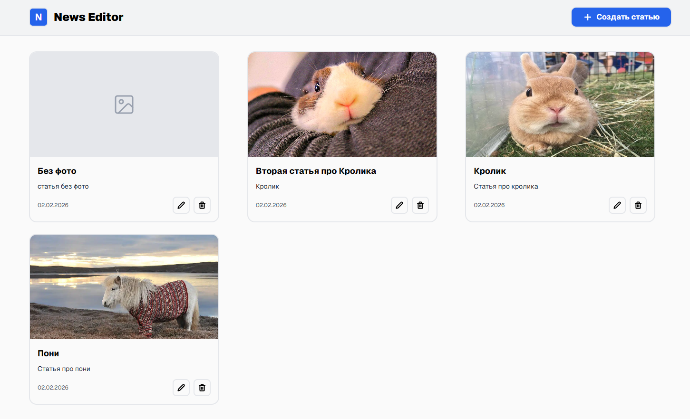
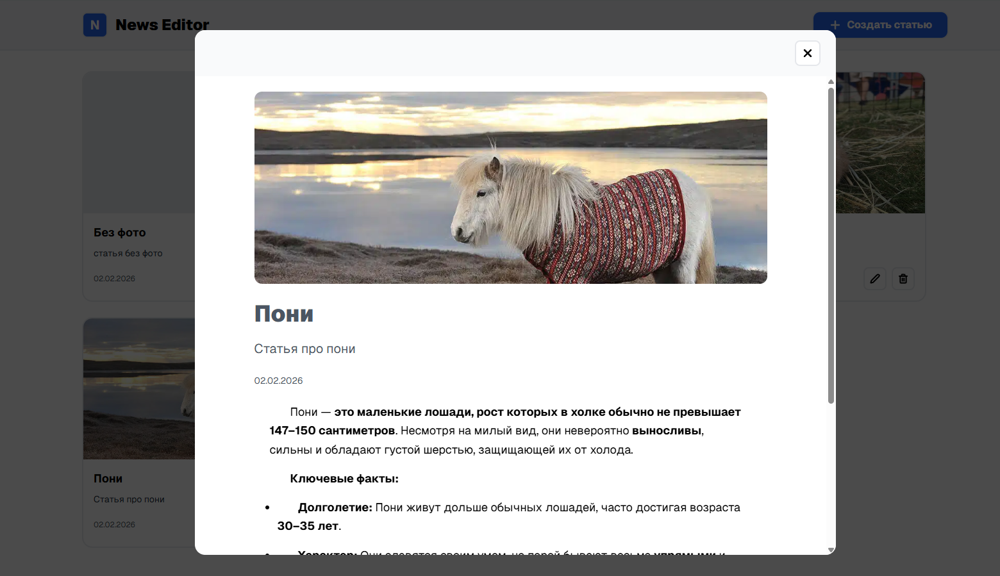
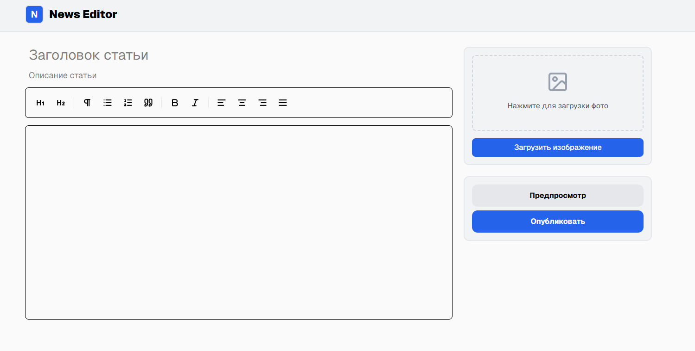
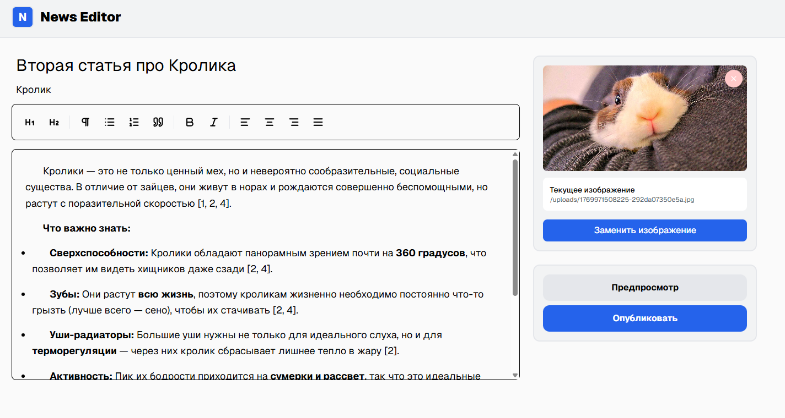

# News Editor

Небольшое fullstack-приложение для создания и публикации статей.
Проект собран на Next.js и PostgreSQL, полностью разворачивается через Docker.

## Возможности

### Backend
- CRUD-операции для новостных статей.
- Хранение данных в PostgreSQL через Prisma ORM.
- Загрузка изображений для статей.
- Генерация уникальных имён файлов.
- Безопасное хранение пользовательских файлов вне `public`.
- Работа с API через Next.js App Router.
- Поддержка миграций базы данных.

### Frontend
- Редактор статей с поддержкой форматирования текста
- WYSIWYG-редактор на базе `TipTap`
- Предпросмотр статьи перед публикацией
- Загрузка и замена изображения статьи
- Отображение опубликованных материалов
- Современный UI на `React` + `Tailwind CSS`

## Demo
Приложение задеплоено и доступно по адресу:

[`http://212.67.10.60:3000/`](http://212.67.10.60:3000/)
## 📸 Скриншоты

<table>
  <tr>
    <td align="center"><strong>Главная страница</strong></td>
    <td align="center"><strong>Предпросмотр статьи</strong></td>
  </tr>
  <tr>
    <td></td>
    <td></td>
  </tr>
  <tr>
    <td align="center"><strong>Создание статьи</strong></td>
    <td align="center"><strong>Редактирование статьи</strong></td>
  </tr>
  <tr>
    <td></td>
    <td></td>
  </tr>
</table>

## 🛠️ Технологический стек

- Next.js (App Router)
- React
- PostgreSQL
- Prisma
- Docker / Docker Compos
- Nginx
- Tailwind CSS
- TipTap

## ⚙️ Запуск проекта локально
### Требования
- Git
- Docker
- Docker Compose

### Установка и запуск

   ```bash
   git clone https://github.com/narutkaa/news-editor.git
   cd news-editor
   cp .env.example .env
   docker compose up --build -d
   ```

### Приложение будет доступно по адресу:
[`http://localhost:3000`](http://localhost:3000)